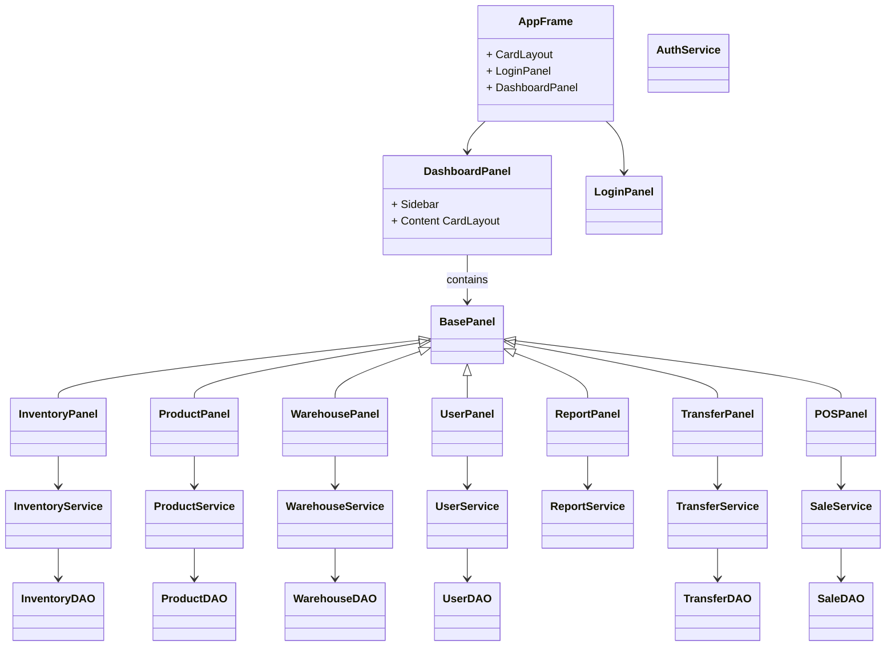

# Branch Management System

A Java Swing desktop application backed by MySQL for managing multi-level warehouses, branches, users, inventory, transfers, and point-of-sale operations.

## Features

- **Role-based access control** with four levels: Super admin → Sup admin → Manager → Sale.
- **Login** with BCrypt password hashing.
- **Per-role dashboards** that render only permitted screens from `Role_Permissions`.
- **Inventory management** scoped to the user's province/branch/warehouse.
- **Product / category / province / warehouse / branch CRUD** (Super admin).
- **User creation** enforced by a single reusable `UserService.canCreate()` scope check.
- **Transfers** between warehouses with approval flow that updates inventory atomically.
- **POS** screen to search products, build a cart, choose payment method, and submit sales.
- **Reports**: sales by date range, top-selling products, current inventory.
- **Audit logging** for creates, updates, deletes, transfers, and sales.

## Technology Stack

- Java 17+ (Swing UI)
- MySQL 8+ / 9+
- JDBC via `mysql-connector-j`
- HikariCP connection pool
- BCrypt via `jbcrypt`
- FlatLaf modern Look & Feel
- LGoodDatePicker for report date ranges
- Maven for dependency management and packaging

## Project Structure

```
src/main/java/com/bms/
  model/      # Plain POJOs: User, Role, Product, Warehouse, Sale, ...
  db/         # DAO classes with raw JDBC only
  service/    # Business logic (Auth, User scope checks, Sales, Reports, Audit)
  ui/         # Swing frames and panels
  util/       # DBConnection, ConfigLoader, PasswordHasher
db/
  schema.sql  # Full DDL + seed data
pom.xml
config.properties
```

## MySQL Setup

1. Start your MySQL server.
2. Create the database and seed data by running the schema script:

```bash
mysql -u root -p < db/schema.sql
```

The script creates the `branch_management` database, all tables, lookup data, and sample users.

## Configure the Application

Edit `config.properties` in the project root:

```properties
db.url=jdbc:mysql://localhost:3306/branch_management?useSSL=false&serverTimezone=UTC&allowPublicKeyRetrieval=true
db.user=root
db.password=your_mysql_password
```

`config.properties` is loaded from the working directory first, then falls back to the classpath.

## Build & Run

### Using Maven (recommended)

```bash
mvn clean package
java -jar target/branch-management-system-1.0.0.jar
```

`pom.xml` uses `maven-shade-plugin` to produce a single runnable JAR.

> On very recent JDK versions you may see a FlatLaf native-access warning.
> Add `--enable-native-access=ALL-UNNAMED` to the `java` command if needed.

### Manual compilation (if Maven is not installed)

Download the required JARs (or use the ones already provided in `lib/`) and compile:

```bash
javac -d target/classes -cp "lib/*" $(find src/main/java -name "*.java")
java -cp "target/classes;lib/*" com.bms.ui.AppFrame
```

## Sample Users

| Username   | Password     | Role        | Scope / Assignment                |
|------------|--------------|-------------|-----------------------------------|
| superadmin | `password`   | Super admin | Unrestricted                      |
| supadmin   | `suppass`    | Sup admin   | Phnom Penh province (warehouse 2) |
| manager    | `managerpass`| Manager     | PP Downtown Branch (branch 1)     |
| sale       | `salepass`   | Sale        | PP Downtown Branch (branch 1)     |

Passwords are stored as BCrypt hashes in the `users` table.

## Role / Permission Mapping

| Role        | Level | Permissions                                           |
|-------------|-------|-------------------------------------------------------|
| Super admin | 0     | manage_main_warehouse, manage_province_warehouse, control_store_warehouse, sell_product, view_reports |
| Sup admin   | 1     | manage_province_warehouse, control_store_warehouse, view_reports |
| Manager     | 2     | control_store_warehouse, view_reports                 |
| Sale        | 3     | sell_product, view_reports                            |

## Account Creation Rules

Implemented in `UserService.canCreate(User creator, int targetRoleId, Integer targetBranch, Integer targetWarehouse)` and called for every user insert:

- Super admin → can create Sup admin, Manager, Sale (no scope check).
- Sup admin   → can create Manager, Sale, but only within their own province.
- Manager     → can create Sale, but only within their own branch.
- Sale        → cannot create users.

## ER Diagram

```mermaid
erDiagram
    Roles ||--o{ Users : assigns
    Roles ||--o{ Role_Permissions : grants
    Permissions ||--o{ Role_Permissions : granted_to
    Roles ||--o| Roles : parent_role
    Provinces ||--o{ Warehouses : contains
    Warehouse_Types ||--o{ Warehouses : typed
    Warehouses ||--o{ Warehouses : parent_warehouse
    Warehouses ||--o{ Branches : serves
    Provinces ||--o{ Branches : located
    Products ||--o{ Inventory : stocked
    Warehouses ||--o{ Inventory : holds
    Products ||--o{ Sale_Items : sold_in
    Sales ||--o{ Sale_Items : contains
    Users ||--o{ Sales : makes
    Payment_Methods ||--o{ Sales : used
    Products ||--o{ Transfers : moved
    Warehouses ||--o{ Transfers : from
    Warehouses ||--o{ Transfers : to
    Users ||--o{ Transfers : approves
    Users ||--o{ Audit_Logs : performs
```

## Class / UI-to-DB Overview



The UI layer only talks to services; the `db` layer only contains JDBC code and never references Swing.

## Security Notes

- All SQL is built with `PreparedStatement`; no string concatenation.
- Passwords are hashed with BCrypt before storage.
- Database credentials live in `config.properties`, never in source code.
- All database operations run on `SwingWorker` background threads to keep the EDT responsive.

## License

This project is provided as a sample academic / training application.
# BMS_project
